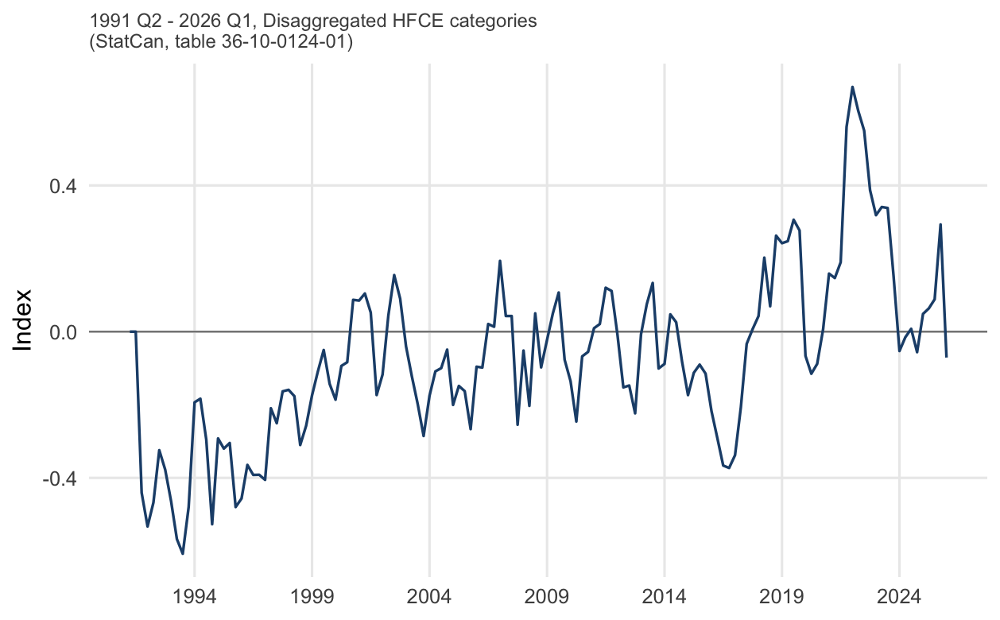
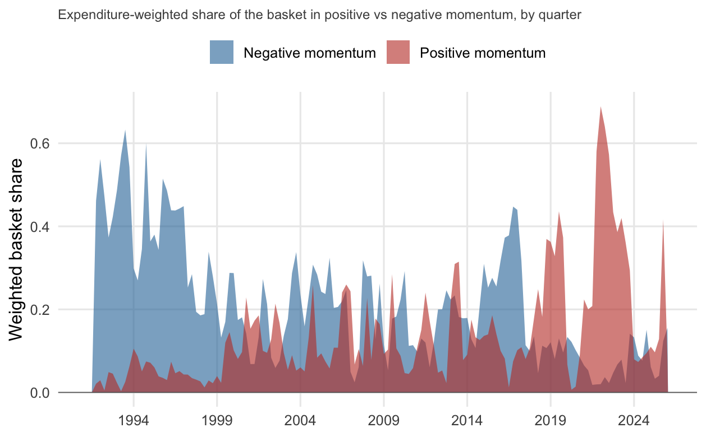

# ISMI

## 1. Introduction

This project documents the construction of an Inflation Shock Momentum Index (ISMI) for Canada, adapted from the methodology developed by
[Lansing and Shapiro (2026)](https://www.frbsf.org/wp-content/uploads/wp2026-10.pdf) at the Federal Reserve Bank of San Francisco. The original index tracks coordinated directional pressure across the distribution of category-level U.S. Personal Consumption Expenditures (PCE) inflation rates, using monthly data. This adaptation reconstructs the same logic for Canada using quarterly Household Final Consumption Expenditure (HFCE) data from Statistics Canada, and documents each point at which the Canadian data required a methodological adjustment relative to the original.

## 2. Data Source

The underlying data are drawn from Statistics Canada [Table 36-10-0124-01](https://doi.org/10.25318/3610012401-eng), Detailed household final consumption expenditure, Canada, quarterly, covering 1981Q1 to the most recent available quarter. Two series are extracted for each expenditure category: current-dollar (nominal) expenditure and 2017 constant-dollar (real, chain-volume) expenditure, both seasonally adjusted at quarterly rates. 

## 3. Methodology 

### 3.1. Resolving the category hierarchy

StatCan's detailed expenditure classification is organized as a nested tree (broadly aligned with COICOP), not a flat list of mutually exclusive categories. Parent categories (e.g. "Housing, water, electricity, gas and other fuels") and their child categories (e.g. "Electricity", "Paid rental fees for housing") both appear in the same list. This is a data-structure issue specific to the Canadian source and has no counterpart in Lansing and Shapiro's original work, where the U.S. BEA already supplies a disaggregated, non-overlapping category list. To resolve it, the parent-child structure was recovered from StatCan's cube metadata file for this table, which records each category's Member ID and Parent Member ID. A category was classified as a leaf if it never appears as another category's parent. Of 132 total nodes in the classification tree, 116 are leaves; of these, 15 are StatCan "adjusting entry" categories (which aren't real spending) and were excluded. This leaves 101 real leaf categories, which form the basis of the index. 
Added together, these 101 categories come to exactly 100% of spending, and their dollar total matches StatCan's official reported total exactly, every single quarter, with no discrepancy.Two of these categories (cannabis for non-medical use and for medical use) didn't exist before their legalization; before that date, their spending is simply treated as zero rather than as missing data. 

### 3.2. Price Index, Inflation Rates, and Expenditure Weights

For each category *i* and quarter *t*, a category-level price index is constructed as the ratio of current-dollar to constant-dollar expenditure:

$$
P_{i,t} = \frac{\text{Current-dollar expenditure}_{i,t}}{\text{Constant-dollar expenditure}_{i,t}} \times 100
$$

The quarter-over-quarter log inflation rate for each category is then:

$$
\pi_{i,t} = \ln(P_{i,t}) - \ln(P_{i,t-1})
$$

And the category's expenditure weight in the total consumption basket is:

$$
w_{i,t} = \frac{\text{Current-dollar expenditure}_{i,t}}{\text{Total current-dollar expenditure}_t}, \qquad \sum_i w_{i,t} = 1
$$

### 3.3. Rolling trend-inflation model and Inflation Shocks

Following the original methodology, each category's inflation rate is modeled as a simple first-order autoregressive process. At each quarter *t* le model 

$$
\pi_{i,s} = \alpha_i + \rho_i \cdot \pi_{i,s-1} + \varepsilon_{i,s}
$$

is estimated by OLS using a rolling window of the W = 40 most recent quarters (10 years) of data ending at *t−1*. The estimated coefficients are then used to form an out-of-sample one-quarter-ahead forecast:

$$
\hat{\pi}_{i,t} = \hat{\alpha}_i + \hat{\rho}_i \cdot \pi_{i,t-1}
$$

And the inflation shock is defined as the forecast error:

$$
\text{shock}_{i,t} = \pi_{i,t} - \hat{\pi}_{i,t}
$$

Lansing and Shapiro use a 120-month (10-year) rolling window on monthly U.S. data. The Canadian data are quarterly, so the window was scaled to 40 quarters (10 years), preserving the same historical span rather than the same number of observations. Because the model requires a full 40-quarter window of history before it can generate its first forecast, the usable shock series begins in 1991Q2 (1981Q1 + 40 quarters) rather than at the start of the raw data.

### 3.4. Index Construction

A category is classified as exhibiting positive momentum at quarter *t* if it has just recorded three consecutive quarters of positive shocks (at *t*, *t−1*, and *t−2*), and negative momentum if it has recorded three consecutive quarters of negative shocks. This is a direct translation of the original three-consecutive-months rule to a three-consecutive-quarters rule, reflecting the change in data frequency rather than a change in the underlying logic.[^1]
[^1]:Across the sample, 11.8% of category-quarters exhibited positive momentum and 21.1% negative momentum, a similar order of magnitude to the 20% positive and 15% negative Lansing & Shapiro find for the US, with the difference explained by country, period, and quarterly vs. monthly frequency.

The final index aggregates the category-level momentum signals using each category's current expenditure weight:

$$
\text{ISMI}_t = \sum_i w_{i,t} \cdot \mathbb{1}[\text{positive momentum}_{i,t}] - \sum_i w_{i,t} \cdot \mathbb{1}[\text{negative momentum}_{i,t}]
$$

That is, the ISMI is the expenditure-weighted share of the consumption basket exhibiting positive inflation-shock momentum, minus the expenditure-weighted share exhibiting negative momentum, at each quarter. Positive values indicate broad-based upward pressure on inflation across categories; negative values indicate broad-based downward pressure.

## 4. Graphical Evidence

### 4.1. Inflation Shock Momentum Index (ISMI) - Canada

This chart covers 1991Q2 to 2026Q1, and it lines up well with Canada's known economic history, even though nothing was adjusted to force that outcome. The index hits its lowest point ever in 1991-1993, matching the disinflation that followed the 1990-91 recession. There's a smaller dip around 2014-2016, likely tied to the oil price crash and its impact on Canada's resource-heavy provinces. The index's highest point ever is in 2022Q1 (+0.669), matching the post-pandemic inflation surge, the strongest reading in over 30 years of data. Between these episodes, from about 1994 to 2019, the index stays close to zero, which fits with two decades of low, stable inflation.

### 4.2. ISMI : Positive vs Negative Share Decomposition

Chart 2 splits the index into its positive and negative parts instead of just showing the difference. It shows that the 2022 peak came from a real, broad jump in the positive side — reaching about 69% of the consumption basket, not from the negative side simply disappearing. This matters: in theory, the index could peak just because negative momentum became rare, without much real positive pressure. That's not what happened here, positive momentum genuinely took over. The same chart shows the opposite pattern in 1991-93, where negative momentum dominates instead. Seeing both extremes behave as mirror images is a good sign the index is measuring something real and consistent, not just a quirk of how it's built.


